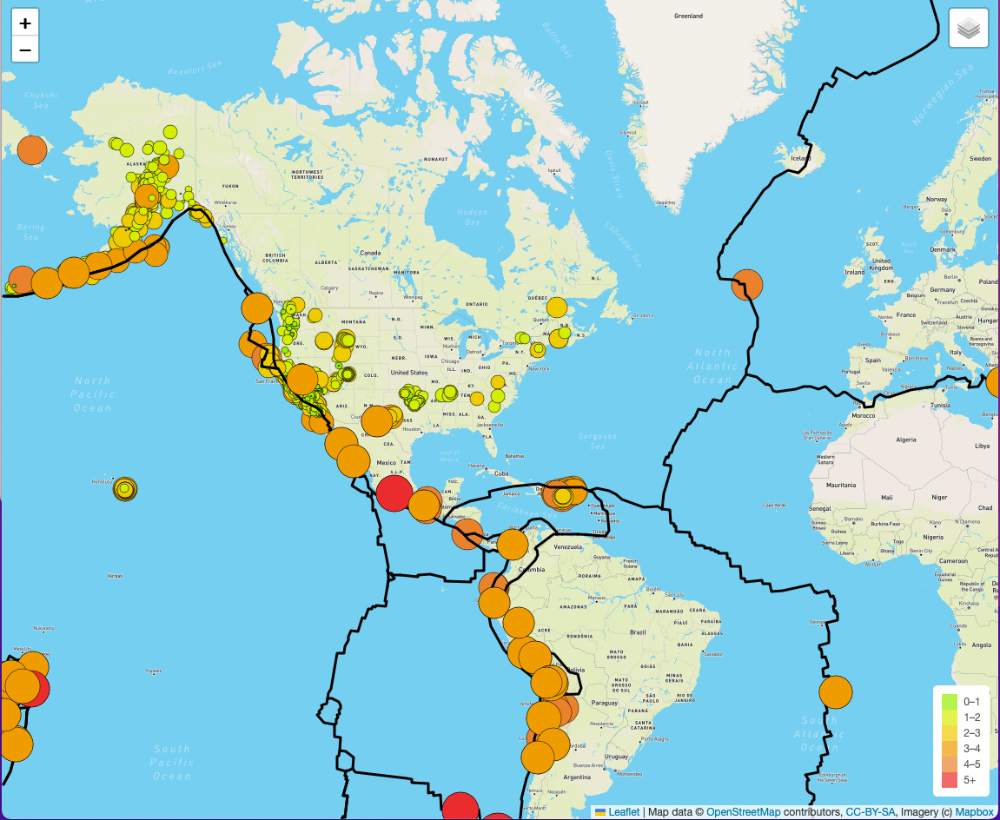
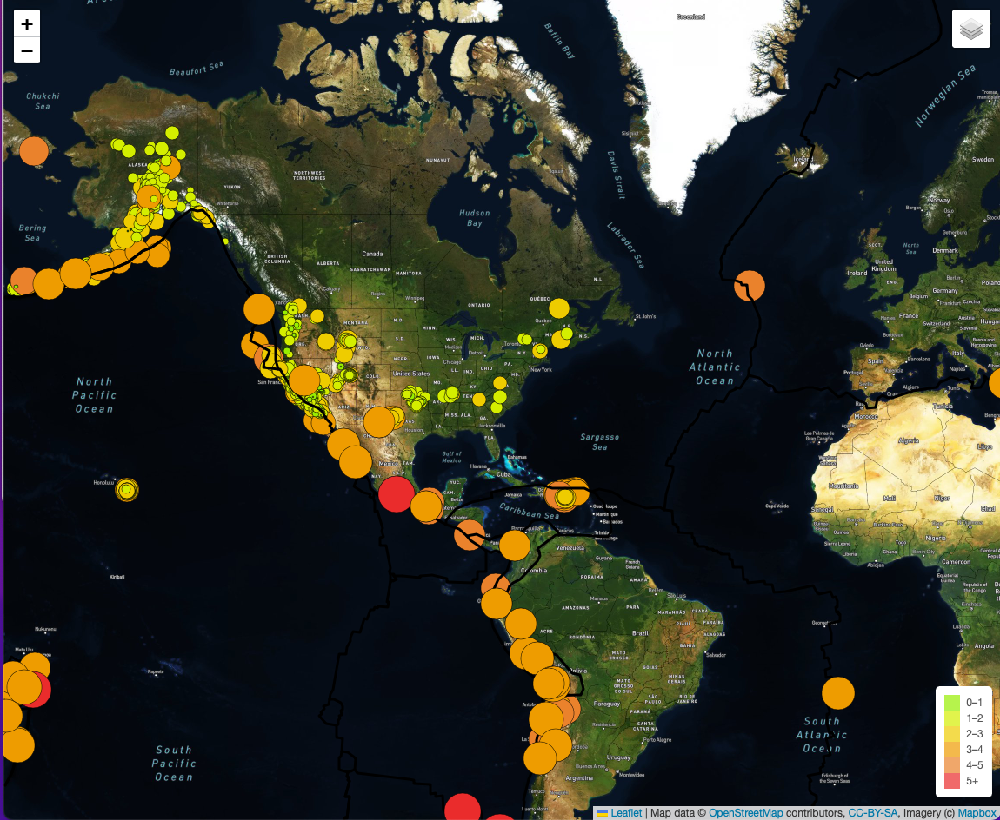
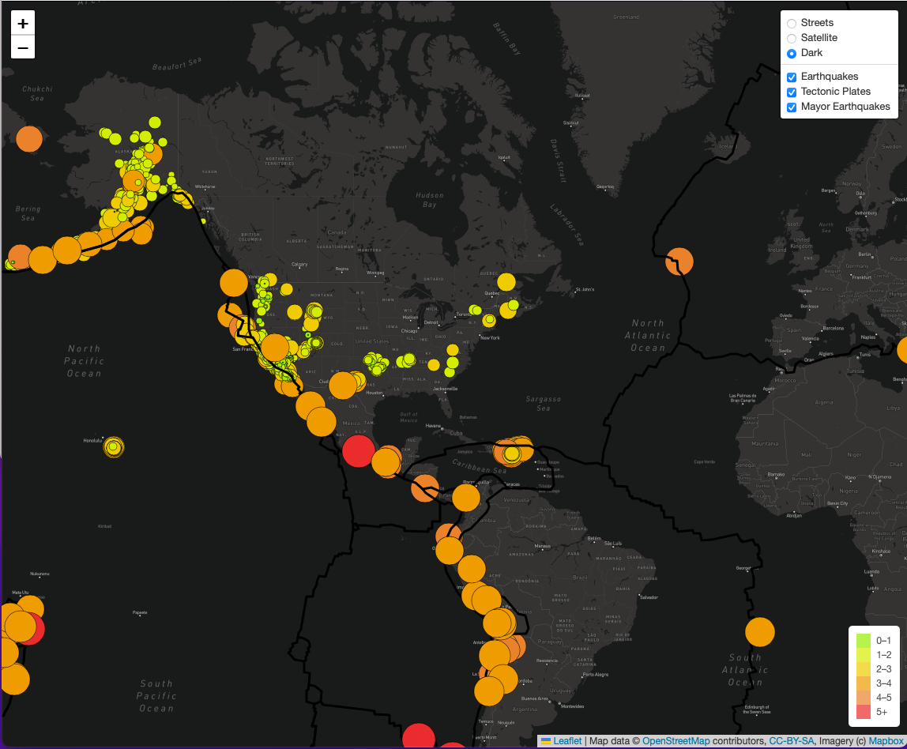

# Mapping_Earthquakes

# Overview
This repository includes a map including earthquakes that happened in the last 7 days. Showing its location and magnitude (bigger circles for bigger magniture earthquakes), it also shows a  legend that shows the color difference in the magnitude of each earthquake. There are three different views of the map, street view, sattelite view and dark view, where the user can toggle between each one and select their preffered option. Also the tectonic plates and earthquakes can be toggled on or off to see only one, two or all three options.

# Results

Was able to show the map with three different views and three different layers showing important information for each earthquake. The layers can be toggled on or off depending on what the user wishes to see and the maps can be toggled between:

street view:

satelite view:

dark view:

# Summary

The map shows all three different views in a toggle option and shows all three different layers of earthquakes nad tectonic plates.
